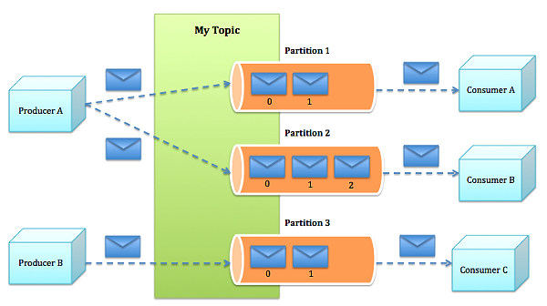

# Kafka Basics and Integration with Spring Boot

## Basic Kafka Architecture for developers

## Lessions
* [Kafka With Plain Java](lession-0/src/main/java/com/surajjannu/kafka)
* [Kafka Topic Creation](lession-1/src/main/java/com/surajjannu/kafka/KafkaTopicCreationApplication.java)
* [Simple Kafka Producer](lession-2/src/main/java/com/surajjannu/kafka/SimpleKafkaProducerApplication.java)
* [Simple Kafka Consumer](lession-3/src/main/java/com/surajjannu/kafka/SimpleKafkaConsumerApplication.java)
* [Custom Kafka Producer](lession-4/src/main/java/com/surajjannu/kafka/ComplexKafkaProducerApplication.java)
* [Custom Kafka Consumer - 1](lession-5/src/main/java/com/surajjannu/kafka/ComplexKafkaConsumerApplication.java)
* [Custom Kafka Consumer - 2](lession-6/src/main/java/com/surajjannu/kafka/ComplexKafkaConsumerFactoryApplication.java)
* [Kafka Message Retry](lession-7/src/main/java/com/surajjannu/kafka/NonBlockingRetryApplication.java)
* [Kafka Message Error Handling](lession-8/src/main/java/com/surajjannu/kafka/ErrorHandlingApplication.java)
* [Kafka Message Batching](lession-9/src/main/java/com/surajjannu/kafka/MessageBatchingApplication.java)
* [Forward messages to topic](lession-10/src/main/java/com/surajjannu/kafka/ForwardListenerResultToNewTopicApplication.java)
* [Consume From multiple topics](lession-11/src/main/java/com/surajjannu/kafka/ComsumeFromMultipleTopicsApplication.java)

## Requests

## Kafka Producer Configuration

## Kafka Consumer Configuration

## Documentation
- https://kafka.apache.org/documentation
- 